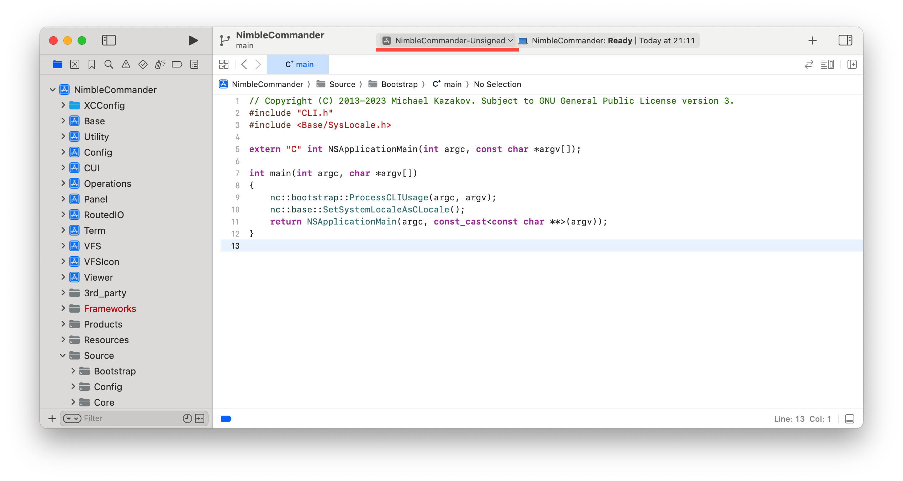

# Building Nimble Commander
This guide outlines the steps to build Nimble Commander from its source code. Follow these instructions to set up your development environment and start contributing to or experimenting with NC.

## Getting the code
The source code for NC is available for cloning. Use the following command to clone the repository:  
`git clone https://github.com/mikekazakov/nimble-commander`  
To minimize internet bandwidth, you can opt to fetch only the latest version with:  
`git clone https://github.com/mikekazakov/nimble-commander --depth=1`

## Compiling the Project
After obtaining the source code, you'll need Xcode 16.0 to open and compile the project. Navigate to the `NimbleCommander.xcodeproj` folder within the source code and open it using either the Xcode GUI or the command line with:  
`open nimble-commander/Source/NimbleCommander/NimbleCommander.xcodeproj`  

Make sure to select the `NimbleCommander-Unsigned` schema in Xcode. Now, you are ready to build the project. Use `Cmd+B` to build and `Cmd+R` to run the project under Xcode's debugger.

## Exploring the Source Code
Nimble Commander has a medium-sized codebase (~150KSloC) written in C++, Objective-C++ and Swift. The project includes the main application and 10 sub-projects:
  * Base: Foundational, general-purpose tools.
  * Config: Configuration management.
  * CUI: Shared UI components.
  * Operations: File operation suite built on the VFS layer.
  * Panel: File panel components.
  * RoutedIO: Admin Mode functionality, including the privileged helper and its client interface.
  * Term: Integrated terminal emulator.
  * Utility: System-specific utilities.
  * VFS: Virtual File Systems, providing a generic interface along with various implementations.
  * VFSIcon: Generates icons and thumbnails for VFS entries.
  * Viewer: Integrated file viewer component.

## Testing
Nimble Commander employs two testing strategies: unit tests (`_UT` suffix) for individual components, and integration tests (`_IT` suffix) for checking how those components interact. Each type of test is easily identifiable by its unique filename suffix and corresponding build target. For example, `Term` represents the library, `TermUT` the unit tests for this library, and `TermIT` the integration tests.  
Unit tests are quick and standalone, not requiring any external setups. In contrast, integration tests might need specific conditions, like running Docker VMs (detailed in `Source/VFS/tests/data/docker/[start|stop].sh`), to properly execute.  

## Limitations
While this source code mirrors that of the official Nimble Commander builds, the public repository does not include sensitive information such as specific accounts, addresses, and keys. Consequently, some features might be restricted or unavailable:
  * Privileged Helper: Requires proper signing to be installed and function correctly.
  * Dropbox VFS: Needs a specific application key for to operate.
  
## Implementation Notes
  * [Syntax Highlighting](SyntaxHighlighting.md)
  * [Creating Image Templates from SF Symbols](ImageTemplatesFromSFSymbols.md)
