# Getting Started

## Introduction

Nimble Commander is a free dual-pane file manager for macOS, designed with a focus on speed, keyboard-based navigation, and flexibility.
The project aims to blend the user experience of classic file managers from the '80s and '90s with the modern look and feel of Mac computers.
Nimble Commander follows the design principles of [orthodox file managers](https://en.wikipedia.org/wiki/File_manager#Orthodox_file_managers), specifically dual-pane file managers.
This website contains an in-depth study of this kind of software: [Less is More: Orthodox File Managers as Sysadmin IDE](https://softpanorama.org/OFM/index.shtml).

## System Requirements

The current version of Nimble Commander supports any Mac running the following versions of macOS:

- macOS 15 Sequoia
- macOS 14 Sonoma
- macOS 13 Ventura
- macOS 12 Monterey
- macOS 11 Big Sur
- macOS 10.15 Catalina

It runs natively on both Intel and Apple Silicon (ARM) architectures.

Below is the compatibility table for older releases of Nimble Commander:

| Versions      | Architecture  | Minimum macOS Version
| ------------- | ------------- | -----------------
| 1.2.9 - 1.7.0 | x64 & ARM64   | macOS 10.15 
| 1.2.0 - 1.2.7 | x64           | OS X 10.11 El Capitan
| 1.1.0 - 1.1.5 | x64           | OS X 10.10 Yosemite
| 1.0.7 - 1.0.9 | x64           | OS X 10.9 Mavericks
| 1.0.5 - 1.0.6 | x64           | OS X 10.8 Mountain Lion
| 0.1.0 - 1.0.4 | x64           | Mac OS X 10.7 Lion

## Installation

Nimble Commander is portable; it doesn't require the installation of additional components and can run from any folder.
When downloaded from the Mac App Store, Nimble Commander is automatically placed in the `/Applications` folder.
If it was downloaded from the website, it can be copied into the `/Applications` folder by dragging the icon there.
You can also run Nimble Commander directly from a `.dmg` disk image; in this case, Nimble Commander will offer to move itself to the `/Applications` folder.

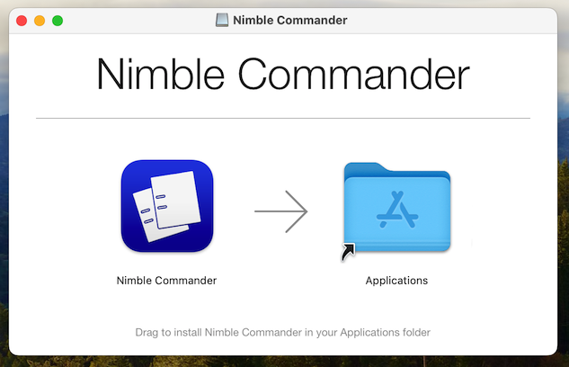

## Running the Application

Simply double-click on the Nimble Commander icon to start it.

## Access Permissions

If you downloaded Nimble Commander from the Mac App Store, the application will request permissions when navigating to a new location.
This requirement is imposed on all applications published in the Mac App Store as a safety measure to prevent unauthorized access outside of the sandbox container.
You can revoke granted access permissions at any time by clicking `Settings > General > Granted filesystem access > Reset`.
The permission request will appear as shown below:

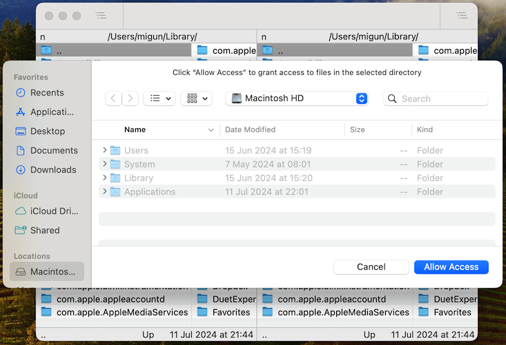

Even if you downloaded Nimble Commander outside of the Mac App Store, accessing certain locations will require granting permissions.
As of this writing, the list of such locations includes:

- Desktop Folder
- Documents Folder
- Downloads Folder
- Network Volumes
- iCloud Drive

To use Nimble Commander in these locations, you need to grant the necessary permissions in System Settings under `Privacy & Security > Files and Folders` section.
Alternatively, you can grant Nimble Commander Full Disk Access in System Settings under `Privacy & Security > Full Disk Access` section.

## Version Differences

There are two existing versions of Nimble Commander: the sandboxed version available in the Mac App Store, and the standalone version available for direct download from the website.
Both versions are mostly equal in terms of functionality.
The sandboxed version consumes slightly more resources due to sandboxing, but it provides an additional layer of protection.
The notable features missing from the sandboxed version are:

- Admin mode, as sandboxed applications are not allowed to install privileged helper tools.
- Integrated terminal, as sandboxed applications are not allowed to send termination signals to other applications.
- Mounting network shares, as sandboxed applications are not allowed to use the NetFS framework.
- Interceping F1..F19 keystrokes as functional without holding the Fn modifier, as sandboxed applications cannot ask for accessbility permissions.

# File Panels

## Introduction
Below is a screenshot of a typical interface of Nimble Commander:

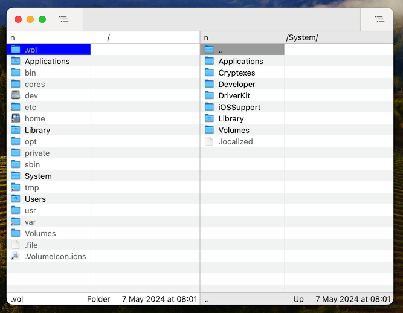

The main window is typically split vertically between the two panels.
Sometimes these panels are called panes; both words will be used interchangeably later on.
Only one panel is active at a time, which is indicated by highlighting.
To change the active panel, you can click on the desired panel or use hotkeys:

- `Tab`: focuses on the opposite panel
- `Shift + Cmd + Left`: focuses on the left panel
- `Shift + Cmd + Right`: focuses on the right panel

The proportion between the left and right panels can be changed by either dragging a vertical separator line or by using the hotkeys: `Ctrl + Alt + Left` and `Ctrl + Alt + Right`.
A panel can also be collapsed entirely so that only one is visible.
This can be achieved by changing the width proportion until one panel is completely removed or by using the hotkey `Shift + Cmd + P`, which toggles between dual-pane and single-pane modes.

Each panel is vertically divided into three logical parts:

- Header: contains the path of the current location and the indicator of the sorting mode.
- File items: displays a list of the file items in the location of this panel.
- Footer: shows the filename of the focused item, its size and modification date, the total number of items in the panel, and the free space available on this storage.

## Navigation
Nimble Commander supports both mouse-based and keyboard-based navigation inside the file panel, although the keyboard is preferred.
Use a single mouse click to change the cursor position (i.e., the focused item) and scroll gestures to scroll through the contents of the file panel without changing the cursor position.
The navigation hotkeys are the following:

- `Up`: moves the cursor up
- `Down`: moves the cursor down
- `Left`: moves the cursor left
- `Right`: moves the cursor right
- `Home`: moves the cursor to the first element
- `Opt + Home`: scrolls the contents to the first element
- `End`: moves the cursor to the last element
- `Opt + End`: scrolls the contents to the last element
- `Page Up`: moves the cursor to the previous page
- `Opt + Page Up`: scrolls the contents to the previous page
- `Page Down`: moves the cursor to the next page
- `Opt + Page Down`: scrolls the contents to the next page

To navigate to a different folder inside the file panel, either double-click on it or press `Return` when the folder is focused.
To go to a parent folder, do the same with the `..` [pseudo-folder](https://en.wikipedia.org/wiki/Path_(computing)#Representations_of_paths_by_operating_system_and_shell) located at the beginning of the items.
Displaying the `..` folder is optional and can be turned off in the Settings dialog.
Pressing `Backward Delete` (Backspace) or `Cmd + Up` navigates to the parent folder, regardless of the current cursor position.

Nimble Commander stores location history for each file panel.
To navigate the history back and forth, use the `Cmd + [` and `Cmd + ]` hotkeys.

There are some locations that can be navigated to using hotkeys:

- `/`: Root of the filesystem
- `~` and `Shift + Cmd + H`: Home folder
- `Shift + Cmd + O`: Documents folder
- `Shift + Cmd + D`: Desktop folder
- `Opt + Cmd + L`: Downloads folder
- `Shift + Cmd + A`: Applications folder
- `Shift + Cmd + U`: Utilities folder

To navigate to a commonly used location, you can use the Go To popup, which can be opened by pressing the `F1` / `F2` hotkey or via the menu: `Go > Left Panel...` / `Go > Right Panel...`.
This popup provides quick access to favorite locations, volumes, connections, and locations of other panels.
Elements of this popup have hotkeys associated with them in the order of appearance: `0`, `1`, ..., `9`, `0`, `-`, `=`.
Any text typed while the Go To popup is open will act as a filter, hiding locations that do not contain the typed text in their names.
Once you click on the selected location, the panel will navigate there and become focused if it wasn’t already.
Here is what the popup looks like:

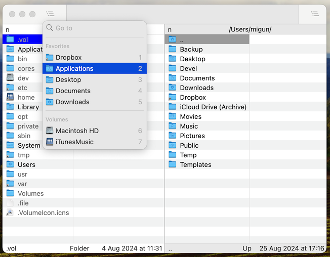

To navigate to an arbitrary location on the filesystem, you can use the GoTo dialog opened by the `Shift + Cmd + G` hotkey or through the menu: `Go > Go To Folder...`.
In this dialog, you can type any path, and after clicking the Go button Nimble Commander will navigate to the specified folder.
Below is the view of this dialog box:

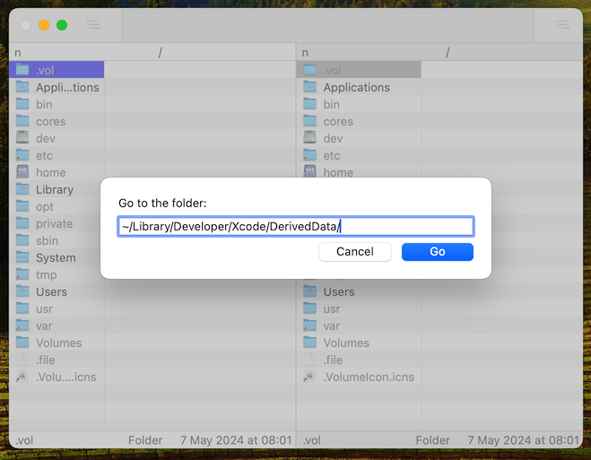

If the cursor is currently pointing to a file that is a symbolic link, the `Cmd + Right` hotkey can be used to navigate to the location the symlink points to.

## Opening Items
The `Return` key does more than just navigate into folders.
The action performed when you press `Return` depends on the type of item:

- For regular folders, it navigates into them.
- For archive files, it opens the archive and takes you to its root directory.
- For executable items, it runs the file inside the built-in terminal emulator.
- For all other items, the default macOS association is used to open them.

If you need to open an archive with a non-standard extension (.xlsx, .pak etc), you can force Nimble Commander to navigate into it instead of opening the item with an external application by using the `Cmd + Down` hotkey or the `Go > Enter` menu item.

The `Shift + Return` hotkey opens an item in macOS using its default association, regardless of the item type.

To open an item outside of Nimble Commander using a specific application, select the application from the `Open With` menu, which is available in the context menu or the `File` menu.

## Panel Management
You can swap the contents of the left and right panels using the `Cmd + U` hotkey or the menu item `View > Swap Panels`.
This operation also transfers the focus to the opposite panel.  
To sync the contents of the opposite panel with the contents of the current panel, you can use the `Opt + Cmd + U` hotkey or the menu item `View > Sync Panels`.  
In most cases, Nimble Commander will automatically refresh the contents of the file panel whenever the underlying part of the filesystem changes.
Sometimes, however, it's not possible to automatically detect these changes.
In such cases, the panel can be manually refreshed using the `Cmd + R` hotkey or the menu item `View > Refresh`.

The two panels in a Nimble Commander's window normally have the same width.
If needed this proportion can be changed by either dragging the splitter located between them or by using the `Ctrl + Opt + Left` / `Ctrl + Opt + Right` hotkeys.
Here is an example of panels with different widths:

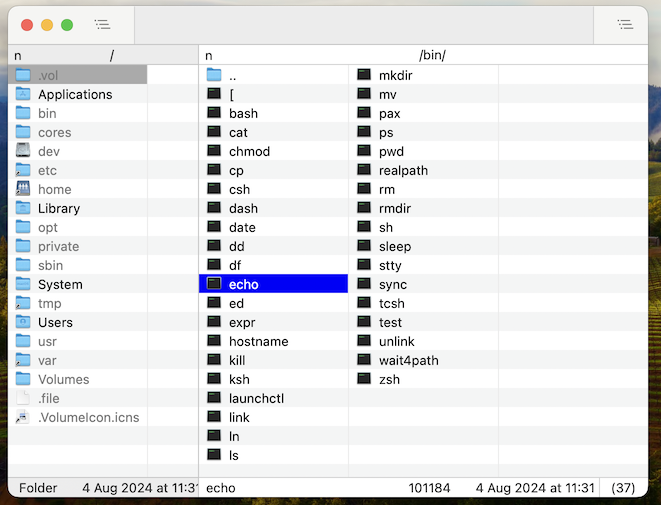

A panel can be collapsed entirely, turning the UI into single-pane mode.
This can also be done via the  `Shift + Cmd + P` hotkey or the `View > Toggle Single-Pane Mode` menu item.
To return to dual-pane mode, expand the collapsed panel the same way it was previously collapsed, or use the `Shift + Cmd + P` hotkey or the `View > Toggle Dual-Pane Mode` menu item.
The following screenshot provides an example of how single-pane mode looks:

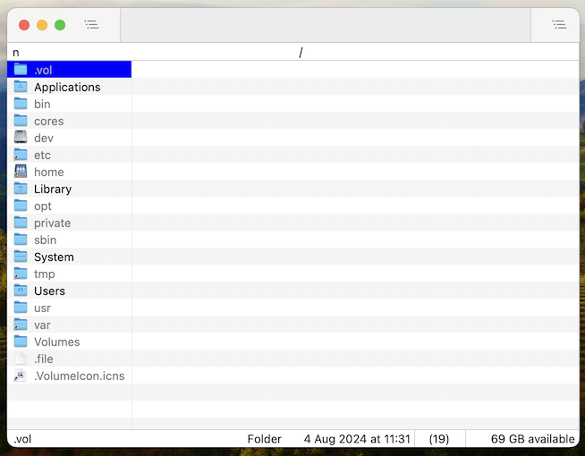

## Selection
Nimble Commander follows the UX of orthodox file managers and diverges from the typical MacOS UX when it comes to item selection.
It treats item selection and cursor position separately, which means moving the cursor does not change the selection of items in the panel.
Below is an example of a panel with some selected items and the cursor focused on an item that is not selected:

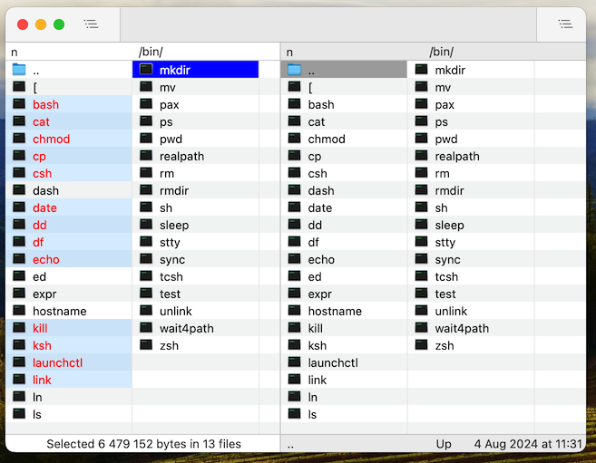

There are numerous ways to manipulate the item selection using the keyboard or mouse in Nimble Commander:

- `Cmd + A`: selects all items.
- `Opt + Cmd + A`: deselects all items.
- `Ctrl + Cmd + A`: inverts the selection.
- `Shift + Up` / `Shift + Down`: inverts the selection of the currently focused item before moving the cursor. The behaviour (selection or deselection) is determined when the `Shift` key is pressed and persists while it is held down.
- `Shift + Cursor Movement`: changes the selection within the range starting at the current cursor position and ending at the new cursor position. The selection is inverted depending on the state of the initially focused item: if it was not selected, the entire range will be selected; if it was already selected, the whole range will be deselected.
- `Enter`: inverts the selection of the currently focused item and moves the cursor to the next item.
- `Cmd + Click`: inverts the selection of the clicked item.
- `Cmd + =`: selects all items with a filename matching the specified file mask or regular expression.
- `Cmd + -`: deselects all items with a filename matching the specified file mask or regular expression.
- `Alt + Cmd + =`: selects all items with the same extension as the currently focused item.
- `Alt + Cmd + -`: deselects all items with the same extension as the currently focused item.

## Sorting Modes
Nimble Commander offers various ways to organize items in a folder.
You can sort the items in ascending or descending order based on the following properties:

- Name
- Extension
- Size
- Modified Time
- Created Time
- Added Time
- Accessed Time

A letter indicator in the top-left corner of the file panel shows the current sorting criteria:

| Indicator | Criteria        | Order           | Example
| --------- | --------------- | --------------- | ---------
| `n`       | Name            | Ascending       | a ... z
| `N`       | Name            | Descending      | z ... a
| `e`       | Extension       | Ascending       | csv ... zip
| `E`       | Extension       | Descending      | zip ... csv
| `s`       | Size            | Descending      | 10 MB ... 1 MB
| `S`       | Size            | Ascending       | 1 MB ... 10 MB
| `m`       | Modified Time   | Descending      | 20:43 ... 18:15
| `M`       | Modified Time   | Ascending       | 18:15 ... 20:43
| `b`       | Created Time    | Descending      | 20:43 ... 18:15
| `B`       | Created Time    | Ascending       | 18:15 ... 20:43
| `a`       | Added Time      | Descending      | 20:43 ... 18:15
| `A`       | Added Time      | Ascending       | 18:15 ... 20:43
| `x`       | Accessed Time   | Descending      | 20:43 ... 18:15
| `X`       | Accessed Time   | Ascending       | 18:15 ... 20:43

This is an example of the sorting pop-up menu shown after clicking on the sorting indicator:

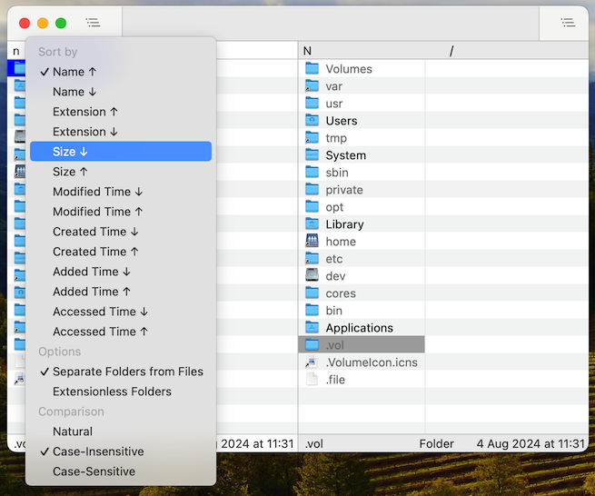

You can change the sorting order by clicking on the indicator and selecting a new option in the pop-up menu, by using the menu `View > Sorting`, by clicking the column headers in List View mode, or via the following hotkeys:

- `Ctrl + Cmd + 1`: Sort by Name.
- `Ctrl + Cmd + 2`: Sort by Extension.
- `Ctrl + Cmd + 3`: Sort by Modified Time.
- `Ctrl + Cmd + 4`: Sort by Size.
- `Ctrl + Cmd + 5`: Sort by Creation Time.
- `Ctrl + Cmd + 6`: Sort by Added Time.
- `Ctrl + Cmd + 7`: Sort by Accessed Time.

When changing the sorting order via hotkeys or the menu, the behavior depends on the previous sorting order.
If the criteria are different, it will switch to the selected criteria with its default order (as shown in the table above). 
Selecting the same sorting criteria again will toggle the order between ascending and descending.

Nimble Commander also provides some customization options to fine-tune sorting:

- `Separate Folders from Files` places all folders before any regular files.
- `Extensionless Folders` forces extension-based sorting to treat any folder as if it doesn't have an extension.
- `Comparison` affects how filenames are compared when determining the order:
  - `Natural`: takes into account locale-specific collation rules and treats digits as numbers. This is the same ordering used by Finder and approximately follows the [Unicode collation algorithm](https://en.wikipedia.org/wiki/Unicode_collation_algorithm). The slowest of the three.
  - `Case-Insensitive`: A Unicode-based comparison that ignores the case of letters in filenames.
  - `Case-Sensitive`:  A simple Unicode-based comparison that compares characters one by one without transformations. The fastest of the three.

## Quick Search
Nimble Commander offers a fast way to locate a file in a folder by typing a few letters from its name.
This keyboard-based navigation is called Quick Search.
It's highly customizable and can behave differently based on your settings, but at its core, the idea is simple: any keyboard input can be used to filter folder items.
To remove the filtering, press the `Esc` button to clear the search query.

Quick Search underscores the items with matching filenames and offers two ways to handle non-matching items: either continue showing them or hide them from the listing.
This behavior can be changed in the `Settings` dialog: `Panel > Quick Search > When searching`: `Show all items` or `Show only matching items`.
The following screenshot shows how Quick Search filters out all items except the two that match the input query 'color':

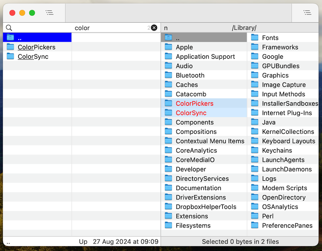

An optional key modifier can be specified so that only keypresses with the chosen modifier will be registered as input for Quick Search.
There are 5 different options for the modifiers that can be chosen in `Panel > Quick Search > Key modifier`:

- `Opt`
- `Ctrl + Opt`
- `Shift + Opt`
- `No modifier` (default)
- `Disabled` (turns off Quick Search altogether)

The input query can be interpreted in different ways.
There are 5 options for matching filenames against it, configurable in `Panel > Quick Search > Where to search`:

- `Fuzzy`: Letters from the input query must appear anywhere in the filename, in the same order.
- `Anywhere` (default): The input query must appear as a whole anywhere in the filename.
- `Beginning`: The filename must start with the input query.
- `Ending`: The filename must end with the input query.
- `Beginning or ending`: The filename must start or end with the input query.

When filtered-out items are configured to still be shown, and a key modifier is set, it can be used to lock navigation within the matching files.
Using normal keyboard navigation (Arrows, Home, End, etc.) while holding the modifier will restrict the cursor movement to only the matching files.

## View Modes
Nimble Commander can display the contents of a panel in two modes: Brief and List.
The Brief mode shows only basic item information, such as the filename, icon, and tag colors, and arranges the items in consecutive columns.
This allows more items to fit on the screen and enables the cursor to move both vertically and horizontally.
The List mode, on the other hand, displays panel items in a table format, where each row represents a single item and each column represents an attribute.
This mode allows only vertical cursor movement.
The screenshot below shows how the same folder, `/usr/bin`, is displayed in Brief and List modes:

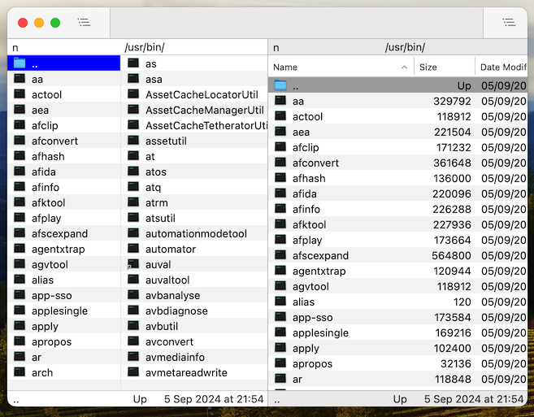

By default, Nimble Commander has 4 preconfigured modes, which you can switch using the `View > View Mode` menu or via the hotkeys listed below:

- `Ctrl + 1` - `Short`: A Brief mode that shows 3 equal-sized columns per panel.
- `Ctrl + 2` - `Medium`: A Brief mode that uses dynamically sized columns depending on the widths of filenames.
- `Ctrl + 3` - `Full`: A List mode that shows the following columns: filename, size, date created, date modified, and date added.
- `Ctrl + 4` - `Wide`: A List mode that shows two columns: filename and size.

You can fine-tune, rearrange, and add new custom panel layouts in the Settings dialog: `Settings > Panels > Layout`.

## Quick Lists
Quick Lists is another mechanism in Nimble Commander for accessing specific locations with minimal keypresses, tailored for keyboard use.
It is similar to the Go To popup but provides more locations and does not mix different types of locations.
A Quick List popup is shown inside the focused panel, and its content can depend on the panel itself.
There are 6 kinds of Quick Lists, which can be accessed via the menu `Go > Quick Lists` or via the hotkeys below:

- `Cmd + 1` - `Parent Folders`: A list of parent folders up to the root of the filesystem.
- `Cmd + 2` - `History`: A history of recent locations visited in this panel.
- `Cmd + 3` - `Favorites`: Favorite and frequently visited locations.
- `Cmd + 4` - `Volumes`: Currently attached system volumes.
- `Cmd + 5` - `Connections`: Network locations that Nimble Commander can connect to. Clicking on a connection establishes it and navigates the panel to the default location on that remote resource.
- `Cmd + 6` - `Tags`: A list of known file tags. Clicking on a tag shows all items with the selected tag in the panel.

This screenshot shows a `Volumes` Quick List:

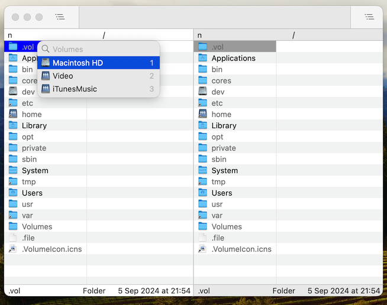

## Tabs
File panels support a tabbed interface, allowing multiple locations to be opened simultaneously on either the left or right pane.
The tab bar appears automatically if more than one tab is open in a pane, but it can also be forced to always show via the menu `View > Show Tab Bar` or by using the hotkey `Cmd + Shift + T`.
The screenshot below shows Nimble Commander's window with two tabs in the left pane and three tabs in the right pane:

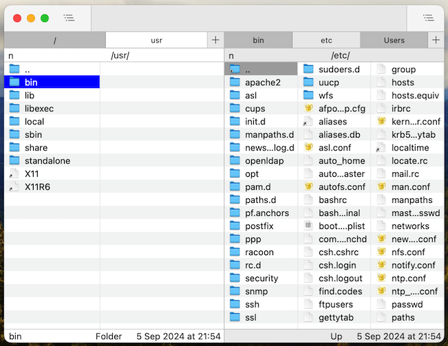

A new tab can be opened in several ways:

- Menu `File > New Tab` or the `Cmd + T` hotkey creates a new tab with the same location.
- Pressing the "+" button next to the tab bar. A long click or right click will display a list of recently closed locations.
- Hitting the `Shift + Cmd + R` hotkey restores the last closed tab and activates it.
- `Alt + Cmd + Return` reveals the currently focused item in a new tab on the opposite pane.

To switch the active tab, the following hotkeys can be used:

- `Shift + Cmd + ]` or `Ctrl + Tab` to switch to the next tab.
- `Shift + Cmd + [` or `Ctrl + Shift + Tab` to switch to the previous tab.
- The `File Panels > Show Tab №1..№10` hotkeys can be assigned to activate a specific tab.

To close tabs, you can use the following hotkeys:

- `Cmd + W` - closes the current tab.
- `Alt + Cmd + W` - closes all other tabs.

## Favorites
Favorites is a list of frequently accessed locations, similar to those in other software. Nimble Commander provides quick access to these locations through the following:

- The `Go > Favorites` menu.
- Go To popups (`F1`/`F2`).
- The Favorites quick list (`Cmd + 3`).

You can manage the list of favorite locations in the Favorites window, which can be opened via the `Go > Favorites > Manage Favorites...` menu or the hotkey `Ctrl + Cmd + B`.
To add a directory to the list, use this window, click the `+` button, and select a path from the drop-down list.
Alternatively, you can add a directory with the hotkey `Cmd + B` or the `File > Add to Favorites` menu item.
Use the `-` button in the Favorites window to remove a location.
The Favorites window also allows you to synchronize the list with Finder Favorites or reset it to the default set of location.
A favorite location can represent any path available in the macOS filesystem or any virtual filesystem supported by Nimble Commander, such as network filesystems, archive contents, file extended attributes, or the process list.

This screenshot shows the `Favorites` window:

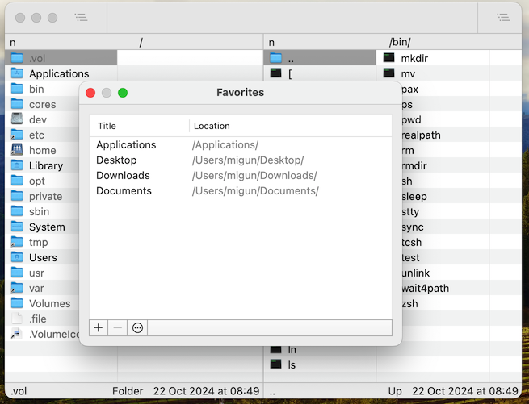

## Searching for Files
To recursively search for filesystem items that meet specific criteria, you can use the `Find Files` dialog. Press `Cmd + F` or select the `File > Find` menu item to open it.

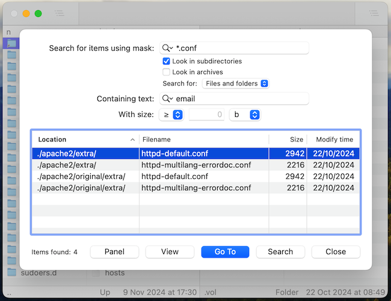

This dialog allows you to search for files based on various criteria:

- Filename Matching.  
  Search for files whose names match a specified pattern. Both file masks and regular expressions are supported.
- Content Search.  
  Find files containing or not containing specific text.
  You can customize the search’s case sensitivity, specify whether an exact phrase match is required, and set the appropriate text encoding.
- File Size.  
  Search for files of a specific size.
  You can specify the size and indicate whether it should be smaller than, equal to, or larger than the specified value.

Once files are found, you can:

- Quickly view a selected file with the built-in viewer while keeping the dialog open.
- Navigate to a selected item in the file panel, which closes the dialog automatically.
- Reveal all found items in a temporary file panel for further actions, also closing the dialog in the process.

# Operations

## Introduction
Nimble Commander executes file operations in the background whenever possible to ensure the user interface remains responsive.
Most operations are tied to the window where they originated, allowing you to monitor progress and providing options to pause or cancel as needed.
When file operations are in progress, they are displayed in the central part of the window, just above the file panels: 

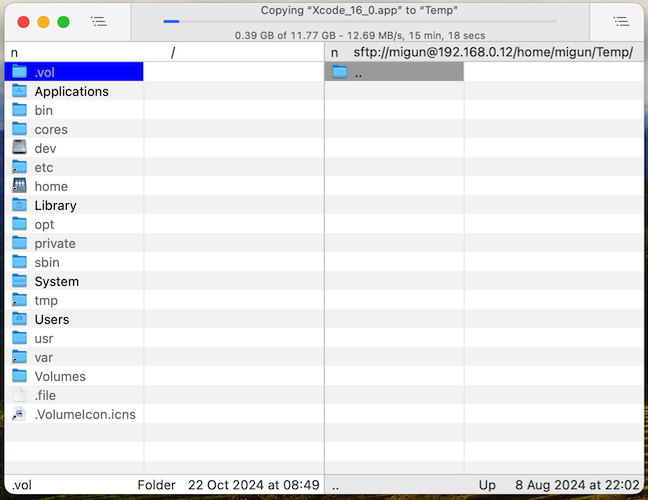

## Copy
You can initiate the copying of filesystem items in several ways:

- Using the `F5` hotkey or selecting the menu item `Command > Copy To...`: This opens the Copy dialog, where you can choose the destination (defaulting to the location of the opposite panel), select which file attributes to retain, and decide whether the copy should be verified.
- Using the `Shift + F5` hotkey or selecting the menu item `Command > Copy As...`: Similar to the option above, but it pre-fills the dialog with the original item's name, allowing you to quickly duplicate the item with a new name.
- Using the `Cmd + V` hotkey: If the pasteboard currently holds a path to a filesystem object, pressing this hotkey will copy that item into the folder displayed in the active file panel.
- Dragging items with the mouse while holding the `Opt` key: This action copies the selected item(s) to the destination.

## Duplicate
Pressing the `Cmd + D` hotkey or selecting the menu item `File > Duplicate` duplicates the selected item(s) in the active panel within their current folder.

## Move
To move items from one location to another, you can use the following methods:

- Using the `F6` hotkey or selecting the menu item `Command > Rename / Move To...`: This opens the Move dialog. Similar to copying, it allows you to select which file attributes to preserve when moving between different filesystems and whether the result should be verified.
- Using the `Shift + F6` hotkey or selecting the menu item `Command > Rename / Move As...`: Similar to the option above, but it pre-fills the dialog with the original item's name. This allows you to quickly rename the item or move it into a sub-folder.
- Using the `Opt + Cmd + V` hotkey: If the pasteboard currently contains a path to a filesystem object, pressing this hotkey moves that item into the folder displayed in the active file panel.
- Dragging items with the mouse: This action moves the selected item(s) to the destination.

## Rename
To quickly rename an item in place, single-click its filename or press Ctrl + F6.

## Batch Rename
Nimble Commander allows you to rename multiple items at once by applying a rename pattern. To open the Batch Rename dialog, select the items you want to rename, then press the `Ctrl + M` hotkey or choose `Command > Batch Rename` from the menu:

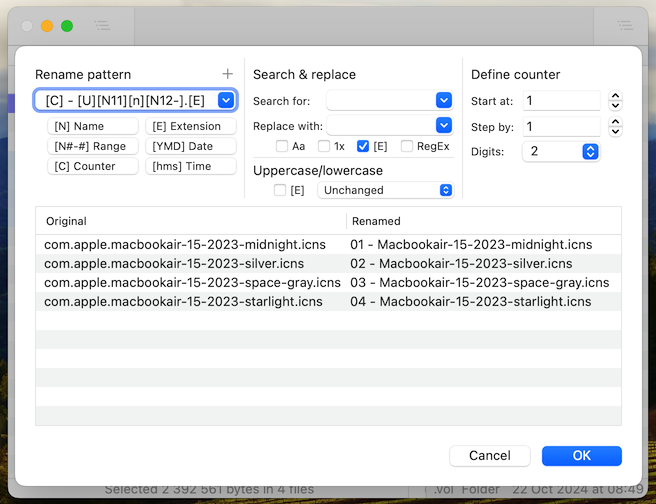

The renaming process consists of the following steps:

  1. Decomposing the original filename and constructing a new one by combining a sequence of placeholders.
  2. (Optional) Searching and replacing parts of the filename.
  3. (Optional) Transforming the letter case.

The placeholders mini-language includes the following elements:

  - Based on the original filename:
    - `[N]`: File name (e.g., `example.txt` -> `example`).
    - `[E]`: File extension (e.g., `example.txt` -> `txt`).
    - `[A]`: Full filename (e.g., `example.txt` -> `example.txt`).
    - `[P]`: Parent filename (e.g., `Parent/example.txt` -> `Parent`).
    - `[G]`: Grandparent filename (e.g., `Grandparent/Parent/example.txt` -> `Grandparent`).
    - All these placeholders have options to query substrings:
      - `[Nx]`: The **x**th character of the string.  
        `example.txt → [N4] → m`
      - `[Nx-y]`: Characters from the **x**th to the **y**th position.  
        `example.txt → [N2-4] → xam`
      - `[Nx,y]`: **y** characters starting from the **x**th position.  
        `example.txt → [N5,2] → pl`
      - `[Nx-]`: Characters starting from the **x**th position to the end.  
        `example.txt → [N5-] → ple`
      - `[NOx-y]`: Characters from the **x**th to the **y**th position, padded with zeros.  
        `example.txt → [N05-10] → 000ple`
      - `[N x-y]`: Characters from the **x**th to the **y**th position, padded with spaces.  
        `example.txt → [N 5-10] → ␣␣␣ple`
      - `[N-x,y]`: **y** characters starting from the **x**th-last position.  
        `example.txt → [N-5,3] → amp`
      - `[N-x-y]`: Characters from the **x**-last to the **y**-last position.  
        `example.txt → [N-5-2] → ampl`
      - `[Nx--y]`: Characters from the **x**th to the **y**th-last position.  
        `example.txt → [N2--2] → xampl`
      - `[N-x-]`: Characters starting from the **x**th-last position to the end.  
        `example.txt → [N-4-] → mple`
  - Based on the file's modification time:
    - `[d]`: Localized date (e.g., `07-12-2024`).
    - `[Y]`: Year in 4-digit format (e.g., `2024`).
    - `[y]`: Year in 2-digit format (e.g., `24`).
    - `[M]`: Month in 2-digit format (e.g., `12`).
    - `[D]`: Day in 2-digit format (e.g., `07`).
    - `[t]`: Localized time (e.g., `13.58`).
    - `[h]`: Hours in 2-digit, 24-hour format (e.g., `13`).
    - `[m]`: Minutes in 2-digit format (e.g., `58`).
    - `[s]`: Seconds in 2-digit format (e.g., `43`).
  - Based on the counter settings:
    - `[C]`: Default counter; all settings are taken from the dialog.  
      `[C] → 1, 2, 3, 4, 5...`
    - `[Cx]`: Counter starting at **x**.  
      `[C5] → 5, 6, 7, 8, 9...`
    - `[Cx+y]`: Counter starting at **x** and incrementing by **y**.  
      `[C5+5] → 5, 10, 15, 20, 25...`
    - `[Cx+y/z]`: Counter starting at **x**, incrementing by **y**, and grouping every **z** items.  
      `[C5+5/2] → 5, 5, 10, 10, 15...`
    - `[Cx+y/z:w]`: Counter starting at **x**, incrementing by **y**, grouping every **z** items, and padding to **w** digits.  
      `[C5+5/2:3] → 005, 005, 010, 010, 015...`
    - Custom settings are optional and can be omitted. For instance, `[C:w]` or `[C+y:w]` are valid.
  - Capitalization commands:
    - `[U]`: Converts the following text to UPPERCASE.
    - `[L]`: Converts the following text to lowercase.
    - `[F]`: Capitalizes the first letter of each word in the following text.
    - `[n]`: Resets capitalization; the following text retains its original case.
  - Other placeholders:
    - `[[`: Inserts an opening square bracket (`[`).
    - `]]`: Inserts a closing square bracket (`]`).

The Rename Dialog provides a preview of how the renamed list of files will look.
No renaming will take place until you click the `OK` button or press `Cmd + Return`.

## Delete
Nimble Commander allows you to delete filesystem items or move them to the Trash, where supported.
To quickly move an item to the Trash, press the `Cmd + Backspace` hotkey or select the menu item `Command > Move to Trash`.
If the Trash functionality is not supported on the current volume, a Delete dialog will appear, asking you to confirm whether you want to delete the item permanently.
You can also invoke the Delete dialog using the `F8` / `Shift + F8` hotkeys or their corresponding menu items: `Command > Delete...` and `Command > Delete Permanently...`.
When applicable, the dialog provides an option to choose between deleting and moving to the Trash.
The difference between the two commands lies in the default selection presented in the dialog.

## Create Folder
There are two ways to create a folder in Nimble Commander:

  - Using the `F7` hotkey or the menu item `Command > Create Directory`. 
    This command opens the Create Directory dialog, where you can specify the name of the new folder before making any changes to the filesystem.
    This method also allows you to create missing folders in a nested path.
    For example, entering `New 1/New 2/New 3` will create three nested folders if they do not already exist on the filesystem.
  - Using the `Shift + Cmd + N` hotkey or the menu item `File > New Folder`.
    This command creates a new empty folder with a temporary name and opens an in-place rename editor, allowing you to change the name immediately.

## Create File
Press `Alt + Cmd + N` or select the menu item `File > New File` to create a new, empty file with a temporary name.
An in-place rename editor will appear, allowing you to rename the file immediately.

## Change Attributes
You can change an item's attributes using the `Ctrl + A` hotkey or by selecting the `Command > File Attributes` menu item:

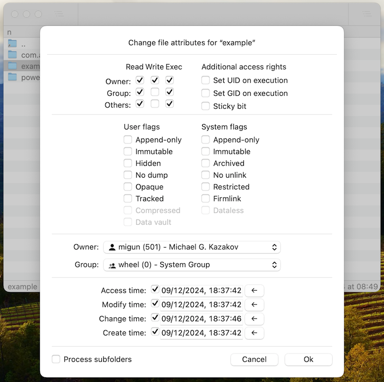

This dialog displays the current permissions, flags, ownership, and timestamps.
It supports changing these attributes for multiple items simultaneously.
In such cases, differences between the items will be indicated by indeterminate checkbox states.

If any of the selected items is a folder, the dialog provides an option to apply the changes recursively to all nested items.

Please note that changing certain attributes requires administrator rights and will fail if executed without enabling Admin Mode.

## Compress
Nimble Commander includes a built-in compression tool that allows you to archive files.
Currently, only the ZIP archive format is supported.
Archives can be password-protected using AES-256 encryption.

To create an archive in the same location as the source items, press `F9` or select `Command > Compress...` from the menu.
To place the resulting archive in the location of the opposite panel, press `Shift + F9` or select `Command > Compress To...`.

## Manage Links
In Nimble Commander, you can create new hard links and create or edit symbolic links.
By default, these actions do not have assigned hotkeys.
They can be accessed via the `Command > Links` menu, which includes the following options:

- `Create Hard Link`.
- `Create Symbolic Link`.
- `Edit Symbolic Link`.

# Virtual File Systems
In addition to browsing the "real" filesystem available on MacOS, Nimble Commander allows you to interact with other resources as if they were part of the normal filesystem.
Most operations, such as browsing, searching, viewing, and modifying, work seamlessly with these virtual filesystems (VFS).
When a file on a VFS is modified using an external editor, Nimble Commander automatically reflects the changes in the underlying VFS.

Currently, the following virtual filesystems are supported:

- **Archives and Compressed files**  
  File types include ar, bz2, bzip2, cab, cpgz, cpio, gz, gzip, iso, jar, lha, lz, lzma, lzo, lz4,  mtree, pax, rar, tar, xar, xz, z, zip, zst, 7z.
  Archives can be opened in read-only mode, and modifications are not allowed.
  Paths of archived folders will include a prefix derived from the archive’s own path.
- **Network protocols**
  - FTP  
    Enables connection to FTP servers.
    Paths for these resources will have an `ftp://` prefix.
  - SFTP
    Enables connection via the `SSH` protocol when the `SSH File Transfer Protocol` is enabled.    
    Paths for these resources will have an `sftp://` prefix.
  - WebDAV  
    Enables connection to WebDAV servers.
    Paths for these resources will have `http://` or `https://` prefixes.
  - DropBox  
    Enables direct connection to Dropbox storage.
    Paths for these resources will have a `dropbox://` prefix.
- **Extended attributes**  
  You can open an item’s [extended attributes (xattrs)](https://en.wikipedia.org/wiki/Extended_file_attributes#macOS) as a read-write folder and interact with these attributes as though they were regular files.
- **Process list**  
  This VFS displays all processes running on the computer as files in a folder.
  Each file represents a process and contains textual information about that process.
  Deleting a file from this VFS will terminate the corresponding process.

# External Editors
You can configure a list of editor applications in the `Settings` dialog.
To modify these settings, navigate to `Nimble Commander > Settings > Editors`.
When you press `F4` or select the `Command > External Editor` menu item, Nimble Commander selects an appropriate editor based on the file extension of the currently focused file and opens the file in that editor.
External editors can be executed either as standalone macOS applications or as command-line tools within Nimble Commander’s terminal emulator.

# Tools
Similar to external editors, tools allow you to define a set of applications that Nimble Commander can execute.
The key difference is that, with tools, you have full control over the parameters passed to the application at startup.  
Additionally, tools can be assigned a designated hotkey, and their icons can be placed on the toolbar for easy access.
To define external tools, navigate to `Nimble Commander > Settings > Tools`.  

To execute a tool, you can:

  - Press its hotkey (if specified).
  - Click its icon in the toolbar (if added).
  - Select its menu item from the `Command > Tools` menu.

External tools can only be executed when a panel points to a location on the macOS filesystem.
Virtual File Systems (VFS) are not supported.

When called, tools can run in one of two modes, depending on the `Startup Mode` setting:

  - `Run Detached`: Executes the tool as a standalone macOS application.
  - `Run in Terminal`: Executes the tool as a command-line utility within Nimble Commander’s terminal emulator.

The parameters passed to an external tool are defined using placeholders.
Nimble Commander replaces these placeholders with specific values when the tool is executed.

Supported placeholders:

- Insert the focused item:
  - From the source (current) panel:
    - `%p`: Item's path.
    - `%f`: Item's filename.
    - `%n`: Item's filename without the extension.
    - `%e`: Item's extension.
    - `%r`: Panel's path.
  - From the target (opposite) panel:
    - `%-p`: Item's path.
    - `%-f`: Item's filename.
    - `%-n`: Item filename without the extension.
    - `%-e`: Item extension.
    - `%-r`: Panel's path.
- Insert the selected items:
  - From the source (current) panel:
    - `%P`:  File paths as parameters.
    - `%xP`:  File paths as parameters, limited to **x** files.
    - `%LP`: File paths in a temporary text file.
    - `%xLP`: File paths in a temporary text file, limited to **x** files.
    - `%F`: Filenames as parameters.
    - `%xF`: Filenames as parameters, limited to **x** files.
    - `%LF`: Filenames in a temporary text file.
    - `%xLF`: Filenames in a temporary text file, limited to **x** files.
  - From the target (opposite) panel:
    - `%-P`:  File paths as parameters.
    - `%-xP`: File paths as parameters, limited to **x** files.
    - `%-LP`: File paths in a temporary text file.
    - `%-xLP`: File paths in a temporary text file, limited to **x** files.
    - `%-F`: Filenames as parameters.
    - `%-xF`: Filenames as parameters, limited to **x** files.
    - `%-LF`: Filenames in a temporary text file.
    - `%-xLF`: Filenames in a temporary text file, limited to **x** files.
- Ask for a value when executed:
  - `%?`: Prompts for the parameter value.
  - `%"message"?`: Prompts for the parameter value with a custom **message**.
- Other placeholders:
  - `%%`: Inserts the `%` character (escaping).
  - `%-`: Switches between source/target panels and left/right panels.
  - `%xT`: Limits the total number of files passed to the tool to **x**.

# Integrated Viewer
Nimble Commander features a built-in viewer that lets you examine files without leaving the application:

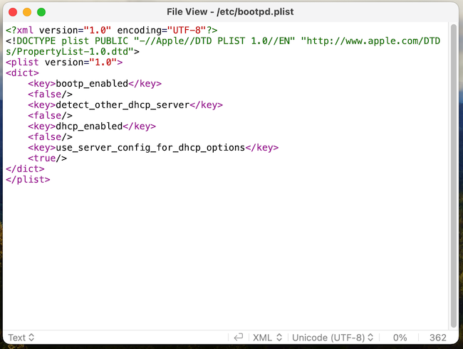

The viewer works seamlessly with both real and virtual filesystems. For instance, you can view compressed files without unpacking the archive first.  
When viewing large files, the integrated viewer loads only a small portion of the file at a time, keeping memory usage minimal.  
If a file is modified while being displayed, the viewer automatically refreshes its contents.  
When viewing the tail of a file, such as an actively updating log file, the viewer adjusts the scroll position automatically to follow new appended data.

The built-in viewer supports three modes:

  - Text Mode (`Cmd + 1`)  
    Displays the file contents as readable text based on the selected encoding.  
    When applicable, syntax highlighting is applied according to the file’s extension.
  - Hex Mode (`Cmd + 2`)  
    Displays the file contents in 16-byte rows as hexadecimal values.  
    Each row includes:
    - Its offset.
    - Two 8-byte blocks of hexadecimal data.
    - A textual representation of the bytes.  
      The selected encoding is used to interpret the file’s bytes as human-readable text.
  - Preview Mode (`Cmd + 3`)  
    Renders the file contents using Quick Look for a graphical or more detailed preview.

The viewer can operate within the application window where it was launched, replacing the file panels with its interface. Alternatively, it can be configured to appear as a separate floating window.

To open the built-in viewer, press the `F3` hotkey or select the `Command > Internal Viewer` menu item. To close it, simply press `Esc`.

# Integrated Terminal
Nimble Commander includes a built-in terminal emulator, allowing you to run command-line utilities without switching to another application.
The terminal emulator supports most VT100 commands and many extensions, such as 256 colors and mouse support.

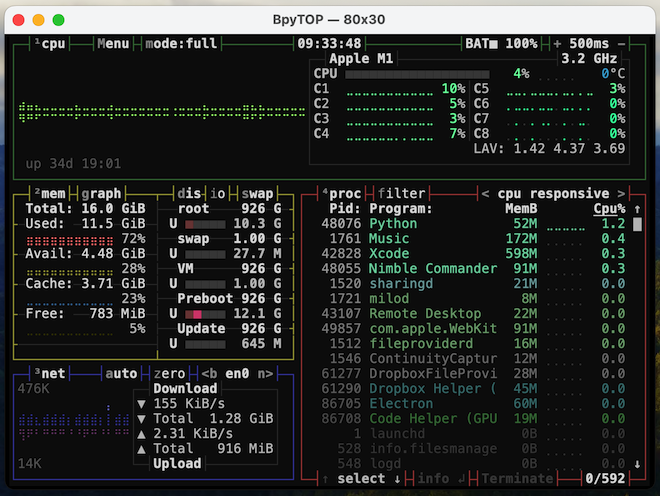

The terminal is context-aware and synchronizes the current panel's folder with the shell's path.
This synchronization is bi-directional, executing `cd` in the terminal updates the panel path, and changing the folder in the panel updates the terminal’s working directory.
Supported terminal shells include `bash`, `zsh`, `csh`, and `tcsh`.

There are two ways to use the terminal emulator in Nimble Commander:

- Full-Window Mode.  
  In full-window mode, the terminal occupies the entire application window, temporarily hiding the file panels.
  This mode is ideal when you need to focus exclusively on command-line tasks.
  You can toggle this mode by pressing `Alt + Cmd + O` or selecting the `View > Show Terminal` menu item.
  To exit and return to the file panels, press `Alt + Cmd + O` again or select the `View > Hide Terminal` menu item.
- Overlapped Mode.  
  In overlapped mode, the terminal is positioned below the file panels, allowing both to remain visible simultaneously.
  This configuration is particularly useful for users familiar with orthodox dual-pane file managers, where a command-line interface is always accessible.
  If desired, you can configure Nimble Commander to redirect keyboard input directly to the overlapped terminal even when it isn’t focused by enabling the option under `Settings > Panels > Behavior > Redirect keyboard input to the overlapped terminal`.
  To reveal the terminal in overlapped mode, press `Ctrl + Alt + Up` to move the file panels upward.
  You can hide it again by pressing `Ctrl + Alt + Down`.
  For a clearer view of the terminal, you can fully hide the file panels by pressing `Ctrl + Alt + O`, and press the same shortcut again to bring the panels back into view.

# Hotkeys
The available hotkeys are listed below. 
These are the default settings, which can be customized as needed. 
Some actions do not have default hotkeys but can still be accessed through the application’s menu.

| Action                                       | Key Equivalent            |
| -----------------------------------------    | ------------------------- |
| _**Nimble Commander Menu**_                  |                           |
| &nbsp; About                                 |                           |
| &nbsp; Preferences                           | Cmd + ,                   |
| &nbsp; Enable Admin Mode                     |                           |
| &nbsp; Hide Nimble Commander                 | Cmd + H                   |
| &nbsp; Hide Others                           | Opt + Cmd+H               |
| &nbsp; Show All                              |                           |
| &nbsp; Quit Nimble Commander                 | Cmd + Q                   |
| &nbsp; Quit and Close All Windows            | Opt + Cmd + Q             |
| _**File Menu**_                              |                           |
| &nbsp; New Window                            | Cmd + N                   |
| &nbsp; New Folder                            | Shift + Cmd + N           |
| &nbsp; New Folder with Selection             | Ctrl + Cmd + N            |
| &nbsp; New File                              | Opt + Cmd + N             |
| &nbsp; New Tab                               | Cmd + T                   |
| &nbsp; Enter                                 | Return                    |
| &nbsp; Open                                  | Shift + Return            |
| &nbsp; Reveal in Opposite Panel              | Opt + Return              |
| &nbsp; Reveal in Opposite Panel Tab          | Opt + Cmd + Return        |
| &nbsp; Paste Filename to Terminal            | Ctrl + Opt + Return       |
| &nbsp; Paste Filenames to Terminal...        | Ctrl + Opt + Cmd + Return |
| &nbsp; Calculate Folders Sizes               | Shift + Opt + Return      |
| &nbsp; Calculate All Folders Sizes           | Ctrl + Shift + Return     |
| &nbsp; Duplicate                             | Cmd + D                   |
| &nbsp; Add to Favorites                      | Cmd + B                   |
| &nbsp; Close                                 | Cmd + W                   |
| &nbsp; Close Window                          | Shift + Cmd + W           |
| &nbsp; Close Other Tabs                      | Opt + Cmd + W             |
| &nbsp; Find...                               | Cmd + F                   |
| &nbsp; Find with Spotlight...                | Opt + Cmd + F             |
| &nbsp; Find Next                             | Cmd + G                   |
| _**Edit Menu**_                              |                           |
| &nbsp; Copy                                  | Cmd + C                   |
| &nbsp; Paste                                 | Cmd + V                   |
| &nbsp; Move Item Here                        | Opt + Cmd + V             |
| &nbsp; Select All                            | Cmd + A                   |
| &nbsp; Deselect All                          | Opt + Cmd + A             |
| &nbsp; Invert Selection                      | Ctrl + Cmd + A            |
| _**View Menu**_                              |                           |
| &nbsp; Toggle Single-Pane Mode               | Shift + Cmd + P           |
| &nbsp; Swap Panels                           | Cmd + U                   |
| &nbsp; Sync Panels                           | Opt + Cmd + U             |
| &nbsp; _**View Mode Submenu**_               |                           |
| &nbsp; &nbsp; Toggle Short View Mode         | Ctrl + 1                  |
| &nbsp; &nbsp; Toggle Medium View Mode        | Ctrl + 2                  |
| &nbsp; &nbsp; Toggle Full View Mode          | Ctrl + 3                  |
| &nbsp; &nbsp; Toggle Wide View Mode          | Ctrl + 4                  |
| &nbsp; &nbsp; Toggle View Mode V             | Ctrl + 5                  |
| &nbsp; &nbsp; Toggle View Mode VI            | Ctrl + 6                  |
| &nbsp; &nbsp; Toggle View Mode VII           | Ctrl + 7                  |
| &nbsp; &nbsp; Toggle View Mode VIII          | Ctrl + 8                  |
| &nbsp; &nbsp; Toggle View Mode IX            | Ctrl + 9                  |
| &nbsp; &nbsp; Toggle View Mode X             | Ctrl + 0                  |
| &nbsp; _**Sorting Submenu**_                 |                           |
| &nbsp; &nbsp; Sort By Name                   | Ctrl + Cmd + 1            |
| &nbsp; &nbsp; Sort By Extension              | Ctrl + Cmd + 2            |
| &nbsp; &nbsp; Sort By Modified Time          | Ctrl + Cmd + 3            |
| &nbsp; &nbsp; Sort By Size                   | Ctrl + Cmd + 4            |
| &nbsp; &nbsp; Sort By Creation Time          | Ctrl + Cmd + 5            |
| &nbsp; &nbsp; Sort By Added Time             | Ctrl + Cmd + 6            |
| &nbsp; &nbsp; Sort By Accessed Time          | Ctrl + Cmd + 7            |
| &nbsp; &nbsp; Separate Folders From Files    |                           |
| &nbsp; &nbsp; Extensionless Folders          |                           |
| &nbsp; &nbsp; Natural Comparison             |                           |
| &nbsp; &nbsp; Case-Insensitive Comparison    |                           |
| &nbsp; &nbsp; Case-Sensitive Comparison      |                           |
| &nbsp; Show Hidden Files                     | Shift + Cmd + .           |
| &nbsp; _**Panels Position Submenu**_         |                           |
| &nbsp; &nbsp; Move Left                      | Ctrl + Opt + Left         |
| &nbsp; &nbsp; Move Right                     | Ctrl + Opt + Right        |
| &nbsp; &nbsp; Move Up                        | Ctrl + Opt + Up           |
| &nbsp; &nbsp; Move Down                      | Ctrl + Opt + Down         |
| &nbsp; &nbsp; Show Panels                    | Ctrl + Opt + O            |
| &nbsp; &nbsp; Focus Overlapped Terminal      | Ctrl + Opt + Tab          |
| &nbsp; Show Tab Bar                          | Shift + Cmd + T           |
| &nbsp; Show Toolbar                          | Opt + Cmd + T             |
| &nbsp; Show Terminal                         | Opt + Cmd + O             |
| _**Go Menu**_                                |                           |
| &nbsp; Left Panel...                         | F1                        |
| &nbsp; Right Panel...                        | F2                        |
| &nbsp; Back                                  | Cmd + [                   |
| &nbsp; Forward                               | Cmd + ]                   |
| &nbsp; Enclosing Folder                      | Cmd + Up                  |
| &nbsp; Enter                                 | Cmd + Down                |
| &nbsp; Follow                                | Cmd + Right               |
| &nbsp; Documents                             | Shift + Cmd + O           |
| &nbsp; Desktop                               | Shift + Cmd + D           |
| &nbsp; Downloads                             | Opt + Cmd + L             |
| &nbsp; Home                                  | Shift + Cmd + H           |
| &nbsp; Library                               |                           |
| &nbsp; Applications                          | Shift + Cmd + A           |
| &nbsp; Utilities                             | Shift + Cmd + U           |
| &nbsp; Root                                  |                           |
| &nbsp; Processes List                        | Opt + Cmd + P             |
| &nbsp; _**Favorites Submenu**_               |                           |
| &nbsp; &nbsp; Manage Favorites...            | Ctrl + Cmd + B            |
| &nbsp; _**Recently Closed Submenu**_         |                           |
| &nbsp; &nbsp; Restore Last Closed Panel      | Shift + Cmd + R           |
| &nbsp; _**Quick Lists Submenu**_             |                           |
| &nbsp; &nbsp; Parent Folders                 | Cmd + 1                   |
| &nbsp; &nbsp; History                        | Cmd + 2                   |
| &nbsp; &nbsp; Favorites                      | Cmd + 3                   |
| &nbsp; &nbsp; Volumes                        | Cmd + 4                   |
| &nbsp; &nbsp; Connections                    | Cmd + 5                   |
| &nbsp; &nbsp; Tags                           | Cmd + 6                   |
| &nbsp; Go To Folder...                       | Shift + Cmd + G           |
| &nbsp; _**Connect To Submenu**_              |                           |
| &nbsp; &nbsp; FTP Server...                  |                           |
| &nbsp; &nbsp; SFTP Server...                 |                           |
| &nbsp; &nbsp; WebDAV Server...               |                           |
| &nbsp; &nbsp; Dropbox Storage...             |                           |
| &nbsp; &nbsp; Network Share...               |                           |
| &nbsp; &nbsp; Manage Connections...          | Cmd + K                   |
| _**Command Menu**_                           |                           |
| &nbsp; System Overview                       | Cmd + L                   |
| &nbsp; Detailed Volume Information           |                           |
| &nbsp; File Attributes                       | Ctrl + A                  |
| &nbsp; Open Extended Attributes              | Opt + Cmd + X             |
| &nbsp; Copy Item Name                        | Shift + Cmd + C           |
| &nbsp; Copy Item Path                        | Opt + Cmd + C             |
| &nbsp; Copy Item Directory                   | Shift + Opt + Cmd + C     |
| &nbsp; Select With Mask                      | Cmd + =                   |
| &nbsp; Select With Extension                 | Opt + Cmd + =             |
| &nbsp; Deselect With Mask                    | Cmd + -                   |
| &nbsp; Deselect With Extension               | Opt + Cmd + -             |
| &nbsp; Preview                               | Cmd + Y                   |
| &nbsp; Internal Viewer                       | F3                        |
| &nbsp; External Editor                       | F4                        |
| &nbsp; Eject Volume                          | Cmd + E                   |
| &nbsp; Batch Rename...                       | Ctrl + M                  |
| &nbsp; Copy To...                            | F5                        |
| &nbsp; Copy As...                            | Shift + F5                |
| &nbsp; Move To...                            | F6                        |
| &nbsp; Move As...                            | Shift + F6                |
| &nbsp; Rename In Place                       | Ctrl + F6                 |
| &nbsp; Create Directory                      | F7                        |
| &nbsp; Move To Trash                         | Cmd + Backward Delete     |
| &nbsp; Delete...                             | F8                        |
| &nbsp; Delete Permanently...                 | Shift + F8                |
| &nbsp; Compress...                           | F9                        |
| &nbsp; Compress To...                        | Shift + F9                |
| &nbsp; _**Links Submenu**_                   |                           |
| &nbsp; &nbsp; Create Symbolic Link           |                           |
| &nbsp; &nbsp; Create Hard Link               |                           |
| &nbsp; &nbsp; Edit Symbolic Link             |                           |
| _**Window Menu**_                            |                           |
| &nbsp; Minimize                              | Cmd + M                   |
| &nbsp; Enter Full Screen                     | Ctrl + Cmd + F            |
| &nbsp; Zoom                                  |                           |
| &nbsp; Show Previous Tab                     | Shift + Ctrl + Tab        |
| &nbsp; Show Next Tab                         | Ctrl + Tab                |
| &nbsp; Show VFS List                         |                           |
| &nbsp; Bring All To Front                    |                           |
| _**Special Hotkeys**_                        |                           |
| &nbsp; _**File Panels**_                     |                           |
| &nbsp; &nbsp; Move Up                        | Up                        |
| &nbsp; &nbsp; Move Down                      | Down                      |
| &nbsp; &nbsp; Move Left                      | Left                      |
| &nbsp; &nbsp; Move Right                     | Right                     |
| &nbsp; &nbsp; Move to the First Element      | Home                      |
| &nbsp; &nbsp; Scroll to the First Element    | Opt + Home                |
| &nbsp; &nbsp; Move to the Last Element       | End                       |
| &nbsp; &nbsp; Scroll to the Last Element     | Opt + End                 |
| &nbsp; &nbsp; Move to the Next Page          | Page Down                 |
| &nbsp; &nbsp; Scroll to the Next Page        | Opt + Page Down           |
| &nbsp; &nbsp; Move to the Previous Page      | Page Up                   |
| &nbsp; &nbsp; Scroll to the Previous Page    | Opt + Page Up             |
| &nbsp; &nbsp; Toggle Selection               |                           |
| &nbsp; &nbsp; Toggle Selection and Move Down | Enter                     |
| &nbsp; &nbsp; Change Active panel            | Tab                       |
| &nbsp; &nbsp; Previous Tab                   | Shift + Cmd + [           |
| &nbsp; &nbsp; Next Tab                       | Shift + Cmd + ]           |
| &nbsp; &nbsp; Go into Enclosing folder       | Backward Delete           |
| &nbsp; &nbsp; Go into Folder                 |                           |
| &nbsp; &nbsp; Go to Home Folder              | Shift + ~                 |
| &nbsp; &nbsp; Go to Root Folder              | /                         |
| &nbsp; &nbsp; Show Preview                   | Space                     |
| &nbsp; &nbsp; Show Tab №1                    |                           |
| &nbsp; &nbsp; Show Tab №2                    |                           |
| &nbsp; &nbsp; Show Tab №3                    |                           |
| &nbsp; &nbsp; Show Tab №4                    |                           |
| &nbsp; &nbsp; Show Tab №5                    |                           |
| &nbsp; &nbsp; Show Tab №6                    |                           |
| &nbsp; &nbsp; Show Tab №7                    |                           |
| &nbsp; &nbsp; Show Tab №8                    |                           |
| &nbsp; &nbsp; Show Tab №9                    |                           |
| &nbsp; &nbsp; Show Tab №10                   |                           |
| &nbsp; &nbsp; Focus Left Panel               | Shift + Cmd + Left        |
| &nbsp; &nbsp; Focus Right Panel              | Shift + Cmd + Right       |
| &nbsp; &nbsp; Show Context Menu              | Ctrl + Return             |
| &nbsp; _**Viewer**_                          |                           |
| &nbsp; &nbsp; Toggle Text                    | Cmd + 1                   |
| &nbsp; &nbsp; Toggle Hex                     | Cmd + 2                   |
| &nbsp; &nbsp; Toggle Preview                 | Cmd + 3                   |
| &nbsp; &nbsp; Show GoTo                      | Cmd + L                   |
| &nbsp; &nbsp; Refresh                        | Cmd + R                   |

# Frequently Asked Questions

**Q**: I have an idea for Nimble Commander!  
**A**: That’s fantastic! Feel free to contribute your ideas. The entire source code and build instructions for Nimble Commander are available in [this repository](https://github.com/mikekazakov/nimble-commander). Be sure to read through the [CONTRIBUTING](https://github.com/mikekazakov/nimble-commander/blob/main/CONTRIBUTING.md) guidelines carefully before you start.

---

**Q**: Nimble Commander crashes/behaves incorrectly/etc. Can you fix it?  
**A**: Possibly. However, it is often difficult to track down the problem without a detailed description of the setup and a set of reproducible steps. Please spend some time describing in detail what happened and how it can be reproduced. This will greatly help in resolving the issue.

---

**Q**: Can you implement a specific feature or request?  
**A**: Likely not. As Nimble Commander is maintained by a single contributor, resources are limited, and I cannot accommodate all requests due to time and energy constraints. However, contributions from the community are welcome. You can consider implementing the feature yourself. Check out the [contribution guidelines](https://github.com/mikekazakov/nimble-commander/blob/main/CONTRIBUTING.md) for more information.

---

**Q**: Preview lacks a feature XYZ, is it possible to add it?  
**A**: This might be challenging. The entire preview functionality is managed by macOS via the [Quick Look framework](https://en.wikipedia.org/wiki/Quick_Look). Rendition and behaviour for various file types is provided by various plugins in that system-wide framework, and Nimble Commander has no control over it. Currently it doesn’t even have any content-specific logic. While it’s possible to start providing special handling for some specific file types, like images, it would require significant resources to implement, test, and maintain.

---

**Q**: Can Nimble Commander access iCloud storage?  
**A**: Nimble Commander does not provide first-class access to iCloud. Apple does not have an official API to allow applications to directly manipulate items outside of their own containers. At least that’s my understanding of the status quo at the moment of writing (I’d be glad to be proven wrong). However, you can manually navigate to `~/Library/Mobile Documents/com~apple~CloudDocs` and access the items there using the normal UI of Nimble Commander. This usually works, but there is no guarantee that the content of that folder is properly synchronized.

---

**Q**: Nimble Commander crashes with EXC_BAD_INSTRUCTION.  
**A**: This has been observed when macOS Catalina is installed on hardware that is not officially supported. Nimble Commander/x64 requires SSE4.2 since v1.2.9, which is available on all Mac models officially supported by Catalina. If this OS version is installed on a machine with a CPU lacking these instructions, Nimble Commander v1.2.9+ cannot run. The only workaround is to use an older version.

---

**Q**: How can I download a previous version?  
**A**: All previous releases are available here: [https://github.com/mikekazakov/nimble-commander-releases](https://github.com/mikekazakov/nimble-commander-releases)

---

**Q**: Do you plan to add capabilities to modify existing archives?  
**A**: There are no plans to add this feature at the moment unless someone steps up to implement it. The reasons why were discussed here: [https://magnumbytes.com/forum/viewtopic.php?f=6&t=205](https://magnumbytes.com/forum/viewtopic.php?f=6&t=205)

---

**Q**: How to make Nimble Commander restore the state of its windows after it has been closed and restarted?  
**A**: Turn off the checkbox `System Settings > Desktop & Dock > Close windows when quitting an application`. By default, this option is turned on.

---

**Q**: Can I see folders which are starting with dot (for example, ".folder")?  
**A**: Yes, it’s possible to see hidden folders. Toggle this option by selecting `Menu > View > Show Hidden Files` or by pressing `Shift + Cmd + .`.

---

**Q**: Can I open an archive which has an improper extension (for example. .xlsx, .pak etc)?  
**A**: Yes, an archive with an improper extension can be opened by selecting `Menu > Go > Enter`, or by using the hotkey `Cmd + Down`.

---

**Q**: Do dialogs in Nimble Commander have hotkeys?  
**A**: Yes, many dialogs have hotkeys using the Ctrl (^) key modifier. Hovering the mouse cursor over a UI element will display context help, which may show the hotkey for that element.

---

**Q**: Where does Nimble Commander store its state?  
**A**: In these locations:

- Main configuration files (managed by NC):  
`~/Library/Application Support/Nimble Commander/Config`
- Volatile state file (managed by NC):  
`~/Library/Application Support/Nimble Commander/State`
- Windows state (managed by macOS):  
`~/Library/Saved Application State/info.filesmanager.Files.savedState`
- Application defaults (managed by macOS):  
`~/Library/Preferences/info.filesmanager.Files.plist`
- Admin Mode helper binary (managed by macOS):  
`/Library/PrivilegedHelperTools/info.filesmanager.Files.PrivilegedIOHelperV2`
- Admin Mode helper configuration (managed by macOS):  
`/Library/LaunchDaemons/info.filesmanager.Files.PrivilegedIOHelperV2.plist`

---

**Q**: Why does Nimble Commander keep forgetting the theme I selected?  
**A**: Mostly likely, Nimble Commander automatically switches to another theme whenever the macOS system theme changes (Light/Dark) and/or when the app restarts.
You can control this by navigating to `Settings -> Themes -> (...) -> Configure automatic switching...` and either turning off this functionality or setting the theme you want for both Light and Dark appearances.
