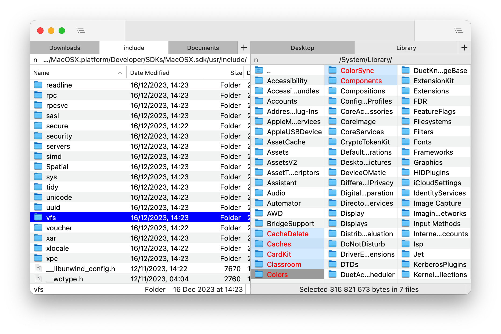

# Nimble Commander

Nimble Commander is a free dual-pane file manager for macOS, designed with a focus on speed, keyboard-based navigation, and flexibility.  
The project's aim is to blend the user experience of classic file managers from the '80s-'90s with the modern look and feel of Mac computers.  
Visit the project's website at: https://magnumbytes.com.  

# Getting Nimble Commander

## Nightly Builds
You can download the latest nightly build of the app from [GitHub Actions](https://github.com/mikekazakov/nimble-commander/actions/workflows/nightly.yml).  
Go to the most recent integration and select the `nimble-commander-nightly` in the `Artifacts` section (a GitHub account is required).

## Current Release
Direct download link: https://magnumbytes.com/downloads/releases/nimble-commander.dmg.  
Available on Mac App Store: https://itunes.apple.com/app/files-lite/id905202937?ls=1&mt=12.  
Install via Homebrew: `brew install nimble-commander`.  

## Past Releases
Access all previous releases at https://github.com/mikekazakov/nimble-commander-releases. 

# Documentation
The user guide can be found here: [Help.md](Docs/Help.md).

# Changelog
Details about each released version can be found in the [WHATS_NEW.md](WHATS_NEW.md) file.

# Building from Source
For build instructions and an overview of the source code, please refer to the [Building.md](Docs/Building.md) document.

# Contributing to the Project
Your contributions are welcome and greatly appreciated! For guidelines on how to contribute, including reporting bugs, suggesting features, and submitting code changes, please see the [CONTRIBUTING.md](CONTRIBUTING.md) file.

# License
Copyright (C) 2013-2024 Michael Kazakov (mike.kazakov@gmail.com)  
The source code is distributed under GNU General Public License version 3.
